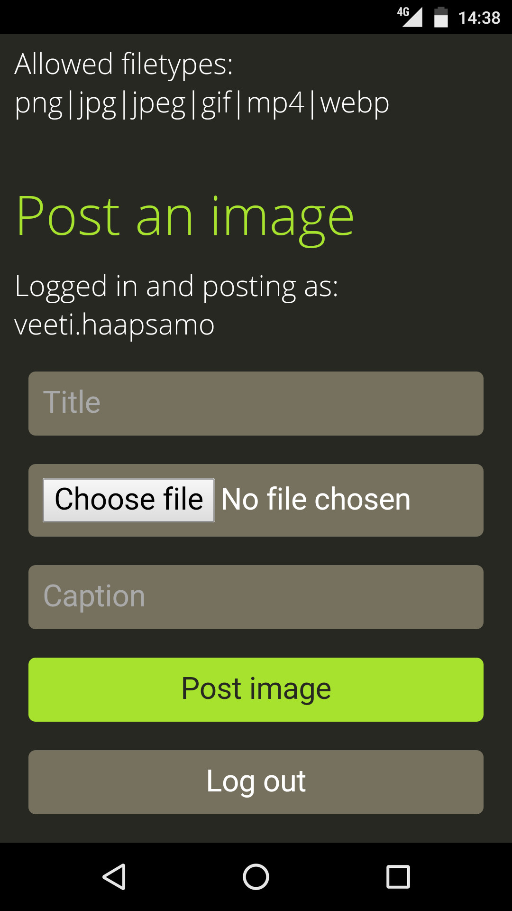

# ReactGIFS

React-based image sharing site with Node.js back end.

Looks great on desktop browsers:

And on mobile too:

In the production version, there's also support for user login via some common providers:

## Usage

- Clone this repository
- `npm install` to install all the dependencies
- Change `prod = true` to `prod = false` in `server.js` to disable auth for local testing
- Change `requireAuth = true` to `requireAuth = false` in `static/reactgifs.js` to set up a default local test user
- Run `node server.js`
- Open http://localhost:8080/ in your favourite browser

## TODO:

- [x] Support for uploading an image post with single image
- [x] Support for separate post metadata and image storage
- [x] Support for posting comments on an image post
- [x] Support for easy local testing by disabling auth with a variable
- [ ] Ensure the API is RESTful
- [ ] Support for submitting multiple images within same post
- [ ] Support for comments of comments; comment-tree
- [ ] Automated testing
- [ ] Continuous integration
- [ ] Improved UX
  - [ ] Most popular images on frontpage
  - [ ] Next / previous post
  - [x] 404 on not data not found
- [ ] User accounts
  - [ ] Post & comment deletion
  - [x] Registration / login
  - [ ] Make sure all providers work
  - [x] Clean up the hash-url after initial login
  - [ ] User profiles
  - [x] Fix login button on gallery pages / not-frontpage
- Thorough analysis & mitigation of possible security vulnerabilities!
  - [x] Primitive filetype checking
